# Segmentacion de Clientes - Modelos No Supervisados

## Maestria en Inteligencia Artificial - UEES / Aprendizaje Automatico - Semana 3

Repositorio para la materia de **Aprendizaje Automatico** - Maestria en Inteligencia Artificial, UEES.

---

**Estudiantes:**

- Ingeniero Gonzalo Mejia Alcivar
- Ingeniero Jorge Ortiz Merchan
- Ingeniero David Perugachi Rojas

**Docente:** Ingeniera Gladys Maria Villegas Rugel

**Fecha de Ultima Actualizacion:** 11 Febrero 2026

---

## Objetivo

Implementar y analizar modelos de aprendizaje no supervisado (K-means, DBSCAN, PCA y t-SNE) para segmentar perfiles de usuario o cliente en un entorno tecnologico. Visualizar resultados, comparar metodos y comunicar conclusiones de forma tecnica y visual.

## Contexto del Caso

Una plataforma digital de servicios personalizados desea segmentar a sus usuarios con base en datos de navegacion, transacciones y comportamiento. El equipo de analitica necesita crear perfiles representativos usando metodos no supervisados para entender mejor el comportamiento y adaptar estrategias de marketing.

## Dataset

- **Archivo:** [E-commerce Dataset.csv](Data/E-commerce%20Dataset.csv)
- **Registros:** 51,290 transacciones
- **Columnas:** 16 (Order_Date, Time, Aging, Customer_Id, Gender, Device_Type, Customer_Login_type, Product_Category, Product, Sales, Quantity, Discount, Profit, Shipping_Cost, Order_Priority, Payment_method)

## Estructura del Proyecto

```text
AA_MaestriaUEES_Semana3/
├── Data/                  # Datasets originales e intermedios
├── Models/                # Modelos entrenados (.pkl)
├── notebooks/             # Jupyter notebooks (opcional)
├── results/               # Reportes (.txt), graficos (.png) y tablas (.csv)
├── scr/                   # Scripts de Python por etapa
├── Alcance.txt            # Documento de alcance del proyecto
├── requirements.txt       # Dependencias del proyecto
└── README.md
```

---

## Etapas del Proyecto

### Etapa 1 - Preparacion del Entorno

**Script:** [01_Preparacion_Entorno.py](scr/01_Preparacion_Entorno.py)

Verificacion de librerias instaladas (pandas, numpy, matplotlib, seaborn, scikit-learn), validacion de la estructura de carpetas del proyecto y carga inicial del dataset.

**Resultados:**

- [01_preparacion_entorno_reporte.txt](results/01_preparacion_entorno_reporte.txt) - Reporte de verificacion del entorno

---

### Etapa 2 - Carga de Datos y Analisis Exploratorio (EDA)

**Script:** [02_CargaDatos_EDA.py](scr/02_CargaDatos_EDA.py)

Analisis exploratorio completo del dataset: tratamiento de valores nulos (8 filas eliminadas, 0.016%), estadisticas descriptivas de variables numericas y categoricas, visualizacion de distribuciones, analisis de correlacion e identificacion de columnas irrelevantes.

**Columnas eliminadas:** Order_Date, Time, Customer_Id, Product, Product_Category, Device_Type
**Columnas conservadas:** Sales, Quantity, Discount, Profit, Shipping_Cost, Aging, Gender, Customer_Login_type, Payment_method, Order_Priority

**Resultados:**

- [02_analisis_exploratorio_reporte.txt](results/02_analisis_exploratorio_reporte.txt) - Reporte estadistico completo
- [02_distribuciones_numericas.png](results/02_distribuciones_numericas.png) - Histogramas con KDE de variables numericas
- [02_boxplots_numericas.png](results/02_boxplots_numericas.png) - Boxplots para deteccion de outliers
- [02_distribuciones_categoricas.png](results/02_distribuciones_categoricas.png) - Graficos de barras de variables categoricas
- [02_matriz_correlacion.png](results/02_matriz_correlacion.png) - Heatmap de correlacion entre variables numericas

---

### Etapa 3 - Preprocesamiento

**Script:** [03_PreProcesamiento.py](scr/03_PreProcesamiento.py)

Codificacion de variables categoricas con LabelEncoder (Gender, Customer_Login_type, Payment_method, Order_Priority) y escalamiento de features numericas con StandardScaler para preparar los datos para algoritmos basados en distancia.

**Features principales (6):** Sales, Quantity, Discount, Profit, Shipping_Cost, Aging

**Resultados:**

- [03_preprocesamiento_reporte.txt](results/03_preprocesamiento_reporte.txt) - Reporte de codificacion y escalamiento

---

### Etapa 4 - Implementacion de Modelos de Clustering

**Script:** [04_Implementacion_Modelos.py](scr/04_Implementacion_Modelos.py)

Implementacion de K-means y DBSCAN con optimizacion de parametros:

- **K-means:** Seleccion del numero optimo de clusters con metodo del codo (Elbow) y coeficiente de silueta (Silhouette). Resultado: K=2 clusters optimos (Silhouette=0.38).
- **DBSCAN:** Estimacion de eps mediante grafico k-distance y grid search sobre muestra de 10,000 puntos. Resultado: eps=0.7, min_samples=20, 8 clusters encontrados.

| Metrica           | K-means | DBSCAN  |
| ----------------- | ------- | ------- |
| Clusters          | 2       | 8       |
| Silhouette Score  | 0.3795  | -0.1020 |
| Calinski-Harabasz | 37,462  | 2,801   |
| Davies-Bouldin    | 1.1241  | 3.8298  |
| Puntos de ruido   | 0       | 5       |

**Resultados:**

- [04_implementacion_modelos_reporte.txt](results/04_implementacion_modelos_reporte.txt) - Reporte completo de modelos y metricas
- [04_elbow_method.png](results/04_elbow_method.png) - Grafico del metodo del codo
- [04_silhouette_scores.png](results/04_silhouette_scores.png) - Grafico de coeficientes de silueta
- [04_kdistance_dbscan.png](results/04_kdistance_dbscan.png) - Grafico k-distance para DBSCAN

---

### Etapa 5 - Reduccion de Dimensionalidad

**Script:** [05_Reduccion_Dimensionalidad.py](scr/05_Reduccion_Dimensionalidad.py)

Reduccion del espacio de 6 dimensiones a 2D para visualizacion.

**Nota sobre el orden del pipeline:** La reduccion de dimensionalidad se ejecuta *despues* del clustering de forma intencional. PCA y t-SNE se utilizan aqui como herramientas de **visualizacion**, no como preprocesamiento. El clustering (Etapa 4) se realiza sobre el espacio completo de 6 dimensiones escaladas para aprovechar toda la informacion disponible, si se hiciera clustering sobre PCA 2D, se perderia un tercio de la varianza (PCA 2D captura solo el 66.5%), una vez obtenidas las etiquetas de cluster, PCA y t-SNE proyectan los datos a 2D para poder graficar y colorear los puntos segun su cluster asignado.

- **PCA:** Reduccion lineal. PC1 captura 48.3% y PC2 captura 18.2% de la varianza (66.5% acumulada). Con 4 componentes se alcanza el 98.5%.
- **t-SNE:** Reduccion no lineal con perplexity=30 y max_iter=1000. Tiempo de ejecucion: ~10 minutos en 51,282 puntos.

**Resultados:**

- [05_reduccion_dimensionalidad_reporte.txt](results/05_reduccion_dimensionalidad_reporte.txt) - Reporte de varianza explicada y parametros
- [05_pca_varianza_explicada.png](results/05_pca_varianza_explicada.png) - Scree plot y varianza acumulada de PCA

---

### Etapa 6 - Visualizacion de Resultados y Conclusiones

**Script:** [06_Visualizacion_Resultados.py](scr/06_Visualizacion_Resultados.py)

Generacion de graficos comparativos, tablas de perfiles por cluster y reflexion final del analisis.

**Perfiles identificados (K-means):**

| Cluster    | Sales | Profit | Shipping_Cost | Interpretacion         |
| ---------- | ----- | ------ | ------------- | ---------------------- |
| 0 (56.3%)  | 99.0  | 30.8   | 3.1           | Clientes de bajo valor |
| 1 (43.7%)  | 221.0 | 121.3  | 12.1          | Clientes de alto valor |

#### Interpretacion de graficos comparativos

**PCA - Clusters K-means vs DBSCAN** ([06_pca_clusters_comparacion.png](results/06_pca_clusters_comparacion.png)):
En la proyeccion PCA, K-means divide los datos en 2 zonas a lo largo del eje PC1 (componente principal que captura el 48.3% de la varianza), la separacion es clara pero lineal: los puntos azul claro (Cluster 0, bajo valor) se concentran a la izquierda y los verdes (Cluster 1, alto valor) a la derecha. En contraste, DBSCAN con 8 clusters muestra una fragmentacion mas granular del mismo espacio, donde los colores se distribuyen en bandas verticales que sugieren que DBSCAN segmenta por rangos de PC1 (dominado por Sales y Profit).

**t-SNE - Clusters K-means vs DBSCAN** ([06_tsne_clusters_comparacion.png](results/06_tsne_clusters_comparacion.png)):
t-SNE revela la estructura no lineal de los datos formando pequenos grupos densos distribuidos en un patron circular, con K-means, los 2 clusters se mezclan visualmente en t-SNE porque la separacion lineal de K-means no se alinea con la estructura local que detecta t-SNE. Con DBSCAN, los 8 clusters se mapean a regiones espaciales mas coherentes en t-SNE: cada color ocupa una zona definida del espacio, lo que indica que DBSCAN captura mejor las agrupaciones locales de densidad que t-SNE tambien detecta.

**Panel comparativo 4 paneles** ([06_comparacion_modelos_4panel.png](results/06_comparacion_modelos_4panel.png)):
Este panel 2x2 permite comparar directamente ambos modelos en ambas proyecciones. La observacion clave es que K-means funciona mejor con PCA (separacion clara en componentes lineales) mientras que DBSCAN se alinea mejor con t-SNE (agrupaciones locales de densidad). Esto refleja la naturaleza de cada algoritmo: K-means minimiza distancias euclidianas (lineal), DBSCAN detecta regiones densas (no lineal).

**Distribucion de tamanio de clusters** ([06_distribucion_clusters.png](results/06_distribucion_clusters.png)):
K-means produce 2 clusters relativamente balanceados (28,853 vs 22,429 transacciones). DBSCAN genera una distribucion desigual: un cluster dominante de 12,250 transacciones (C3), cuatro clusters medianos (C0, C2, C4, C5 entre 7,000-10,000), un cluster intermedio (C1 con 4,996), y dos micro-clusters (C6=206, C7=309) que representan patrones de compra poco comunes. Solo 5 puntos se clasificaron como ruido.

**Heatmap de perfiles K-means** ([06_heatmap_perfiles_kmeans.png](results/06_heatmap_perfiles_kmeans.png)):
El heatmap confirma que la diferencia entre clusters se concentra en Sales, Profit y Shipping_Cost (celdas oscuras en Cluster 1 vs claras en Cluster 0). Las variables Quantity, Discount y Aging tienen valores similares en ambos clusters, lo que indica que la segmentacion de K-means se basa principalmente en el monto monetario de las transacciones, no en el comportamiento de compra (cantidad o sensibilidad al descuento).

**Boxplots por cluster K-means** ([06_boxplots_por_cluster_kmeans.png](results/06_boxplots_por_cluster_kmeans.png)):
Los boxplots muestran que Sales, Profit y Shipping_Cost tienen distribuciones completamente separadas entre clusters (sin solapamiento de cajas), confirmando una segmentacion robusta en estas variables. En cambio, Quantity, Discount y Aging presentan distribuciones casi identicas entre clusters, lo que refuerza que estos factores no son discriminantes en la segmentacion actual.

**Resultados:**

- [06_visualizacion_conclusiones_reporte.txt](results/06_visualizacion_conclusiones_reporte.txt) - Reporte de reflexion y conclusiones
- [06_pca_clusters_comparacion.png](results/06_pca_clusters_comparacion.png) - PCA coloreado por clusters (K-means vs DBSCAN)
- [06_tsne_clusters_comparacion.png](results/06_tsne_clusters_comparacion.png) - t-SNE coloreado por clusters (K-means vs DBSCAN)
- [06_comparacion_modelos_4panel.png](results/06_comparacion_modelos_4panel.png) - Panel comparativo 2x2 (PCA/t-SNE x K-means/DBSCAN)
- [06_heatmap_perfiles_kmeans.png](results/06_heatmap_perfiles_kmeans.png) - Heatmap de perfiles K-means
- [06_heatmap_perfiles_dbscan.png](results/06_heatmap_perfiles_dbscan.png) - Heatmap de perfiles DBSCAN
- [06_distribucion_clusters.png](results/06_distribucion_clusters.png) - Distribucion de tamanio de clusters
- [06_boxplots_por_cluster_kmeans.png](results/06_boxplots_por_cluster_kmeans.png) - Boxplots de features por cluster
- [06_tabla_perfiles_kmeans.csv](results/06_tabla_perfiles_kmeans.csv) - Tabla de perfiles K-means
- [06_tabla_perfiles_dbscan.csv](results/06_tabla_perfiles_dbscan.csv) - Tabla de perfiles DBSCAN

---

## Reflexion y Comunicacion

### 1. Que tipo de perfiles se pueden identificar?

**Con K-means (2 clusters):**

- **Cluster 0 - Transacciones de bajo valor (56.3%):** Sales promedio de 99, Profit de 30.8 y Shipping_Cost de 3.1. Representa compras de menor monto donde el margen de ganancia es reducido. La cantidad (Quantity~2.5), el descuento (Discount~0.3) y la antiguedad (Aging~5.3) son similares al promedio general, lo que indica que este grupo se diferencia exclusivamente por el monto monetario, no por el comportamiento de compra.
- **Cluster 1 - Transacciones de alto valor (43.7%):** Sales promedio de 221, Profit de 121.3 y Shipping_Cost de 12.1. Son compras de mayor monto con margenes de ganancia significativamente superiores. Al igual que el Cluster 0, Quantity, Discount y Aging no varian, lo que sugiere que el valor de la transaccion esta asociado al tipo de producto adquirido, no a la cantidad comprada ni al nivel de descuento.

**Con DBSCAN (8 clusters):** Se obtiene una segmentacion mas granular con un cluster dominante (C3, 23.9%), cuatro clusters medianos (C0, C2, C4, C5 entre 14-19%), un cluster intermedio (C1, 9.7%) y dos micro-clusters (C6=0.4%, C7=0.6%) que capturan patrones de compra atipicos. DBSCAN logra distinguir sub-segmentos dentro de los dos grandes grupos de K-means, aunque con menor coherencia interna (Silhouette negativo).

### 2. Que diferencias clave surgieron entre los modelos?

- **Numero de clusters:** K-means identifico 2 clusters, DBSCAN encontro 8. K-means requiere especificar K a priori (determinado via Elbow y Silhouette), mientras que DBSCAN lo determina automaticamente segun la densidad de los datos.
- **Calidad de la segmentacion:** K-means obtuvo un Silhouette Score de 0.38 (clusters moderadamente separados), mientras que DBSCAN obtuvo -0.10 (clusters solapados). Calinski-Harabasz (37,462 vs 2,801) y Davies-Bouldin (1.12 vs 3.83) tambien favorecen a K-means en este dataset.
- **Tratamiento de outliers:** K-means asigna todos los puntos a un cluster, incluyendo outliers que pueden distorsionar los centroides. DBSCAN clasifico 5 puntos como ruido, demostrando su capacidad para aislar anomalias.
- **Forma de los clusters:** K-means asume clusters esfericos de tamanio similar (basado en distancia euclidiana al centroide). DBSCAN detecta clusters de forma arbitraria basandose en densidad, lo cual se evidencia en la visualizacion t-SNE donde los clusters DBSCAN se alinean con agrupaciones locales de densidad.
- **Interpretabilidad:** K-means produce perfiles claros y accionables para negocio (alto valor vs bajo valor). DBSCAN genera una segmentacion mas compleja que requiere analisis adicional para su interpretacion comercial.

### 3. Que limitaciones encontraron y como las abordarian?

- **Datos a nivel de transaccion, no de cliente:** Cada fila es una orden individual, no un cliente unico. Un mismo cliente puede aparecer en multiples clusters. **Solucion propuesta:** Agregar datos por Customer_Id (promedio de Sales, suma de Quantity, total de Profit, etc.) antes de clustering para obtener perfiles reales de cliente.
- **Variables temporales desaprovechadas:** Order_Date y Time se eliminaron en el preprocesamiento, pero podrian revelar patrones estacionales o de frecuencia. **Solucion propuesta:** Crear features derivadas como mes, dia de la semana, hora del dia y frecuencia de compra por cliente.
- **Maldicion de la dimensionalidad en DBSCAN:** Con 6 dimensiones, la nocion de densidad se diluye y la distancia entre puntos se homogeniza, dificultando que DBSCAN encuentre fronteras claras. **Solucion propuesta:** Aplicar PCA (reduccion a 3-4 componentes que capturan el 98.5% de varianza) antes de ejecutar DBSCAN, o usar OPTICS como alternativa mas robusta.
- **Sensibilidad de DBSCAN a sus parametros:** Pequenos cambios en eps producen resultados drasticamente diferentes (eps=0.5 genera 94 micro-clusters, eps=1.0 colapsa todo en 1 cluster). **Solucion propuesta:** Implementar OPTICS que genera un ordenamiento de accesibilidad independiente de eps, o usar HDBSCAN que selecciona automaticamente la densidad optima.
- **Ausencia de validacion externa:** No existe un ground truth de segmentos reales de clientes para validar si los clusters encontrados son comercialmente significativos. **Solucion propuesta:** Validar los perfiles con expertos del dominio de negocio y medir el impacto de estrategias de marketing diferenciadas por cluster.

---

## Ejecucion

```bash
# Instalar dependencias
pip install -r requirements.txt

# Ejecutar en orden secuencial
python scr/01_Preparacion_Entorno.py
python scr/02_CargaDatos_EDA.py
python scr/03_PreProcesamiento.py
python scr/04_Implementacion_Modelos.py
python scr/05_Reduccion_Dimensionalidad.py
python scr/06_Visualizacion_Resultados.py
```

## Tecnologias

- Python 3.x
- pandas, numpy
- matplotlib, seaborn
- scikit-learn (KMeans, DBSCAN, PCA, TSNE, StandardScaler)

---

## Galeria de Resultados (PNG)

### Etapa 2 - EDA

**Distribuciones Numericas**
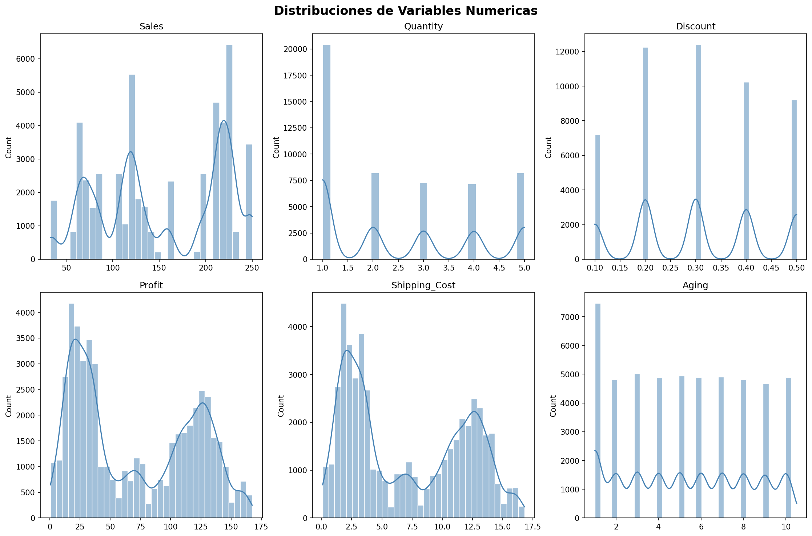

**Boxplots Numericas**
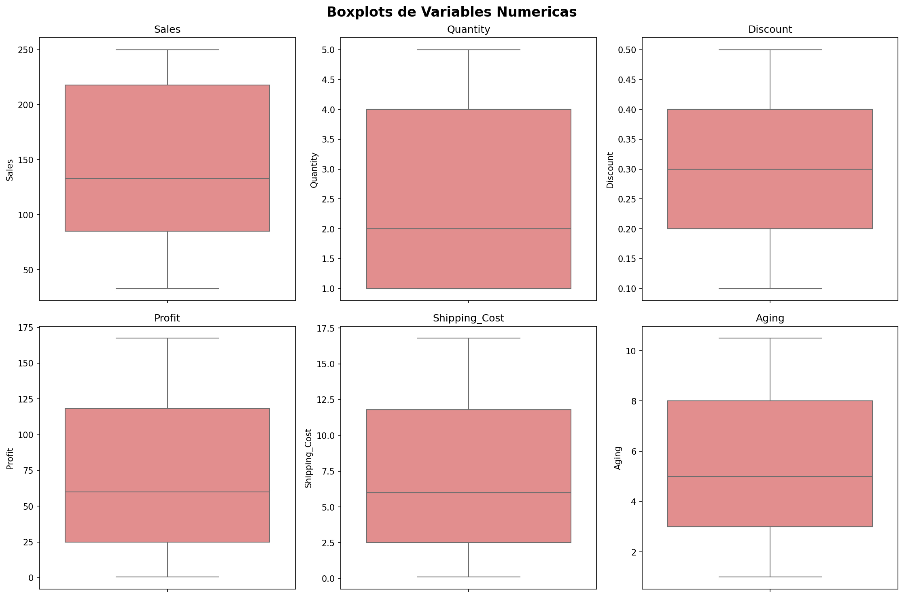

**Distribuciones Categoricas**
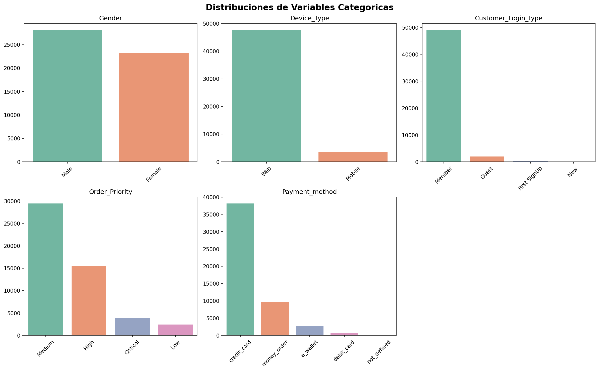

**Matriz de Correlacion**
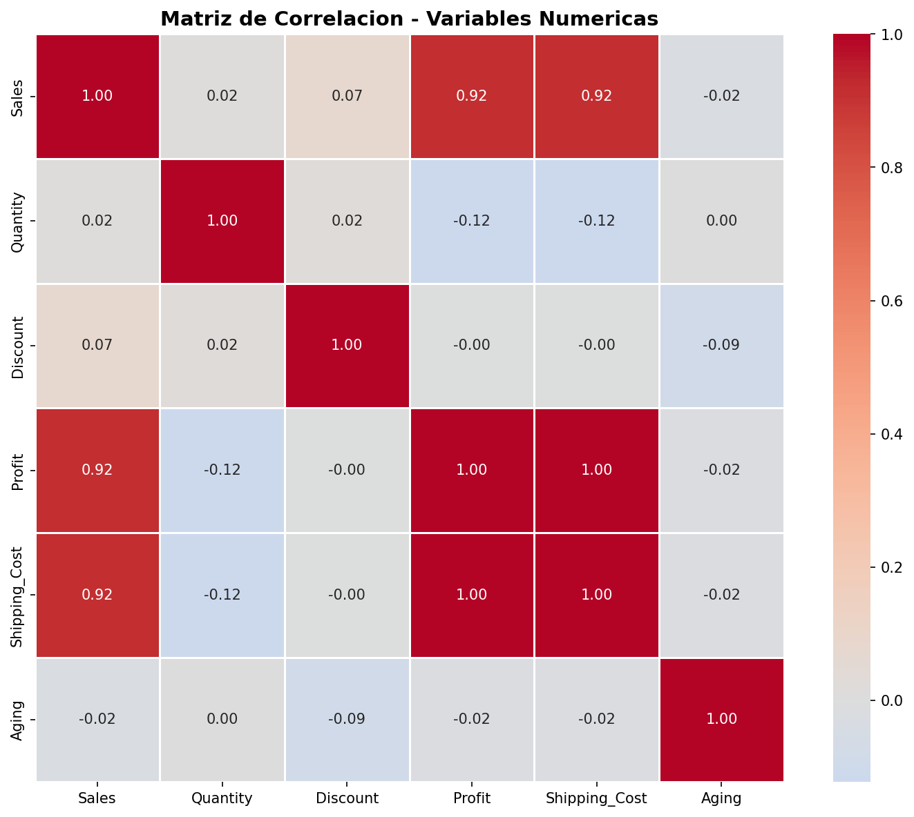

### Etapa 4 - Clustering

**Metodo del Codo (Elbow)**
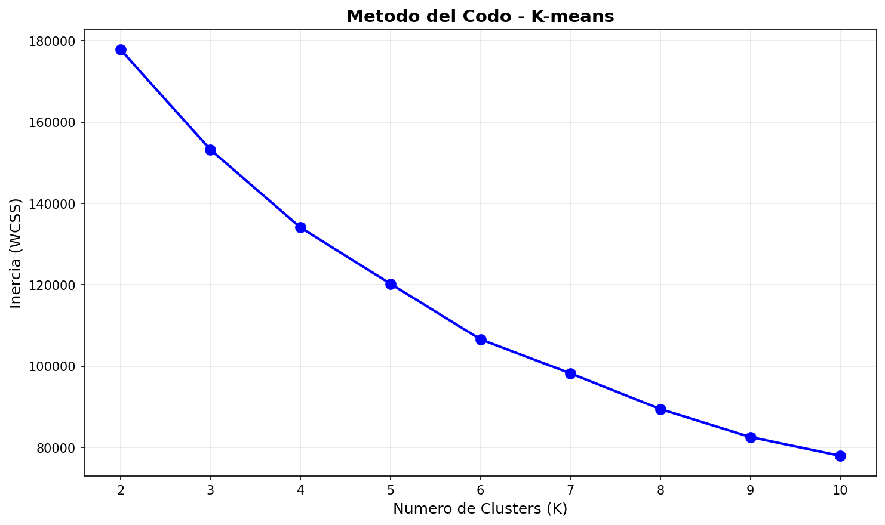

**Silhouette Scores**
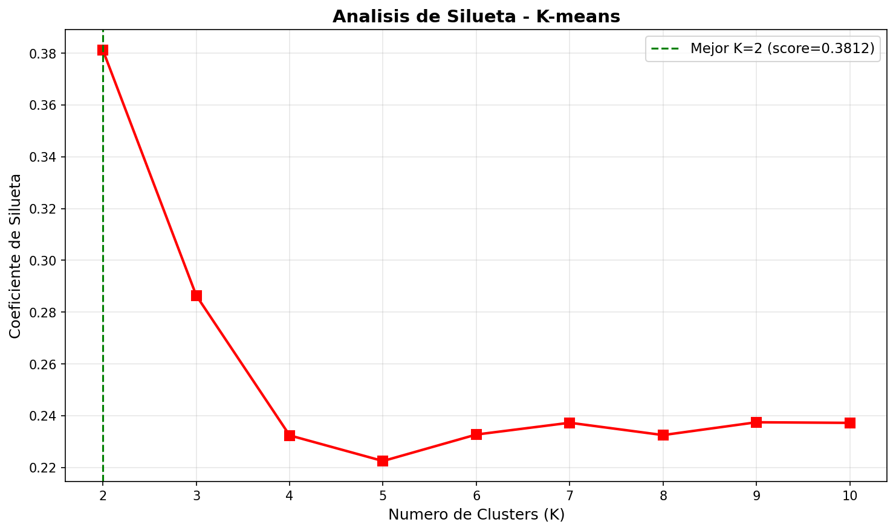

**K-distance para DBSCAN**
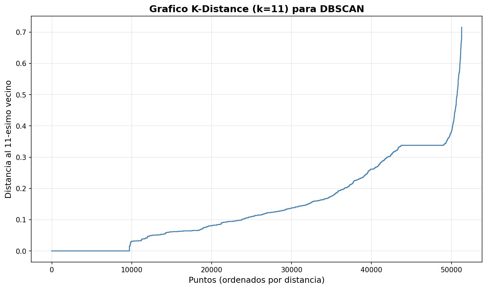

### Etapa 5 - Reduccion de Dimensionalidad (Galeria)

**Varianza Explicada PCA**
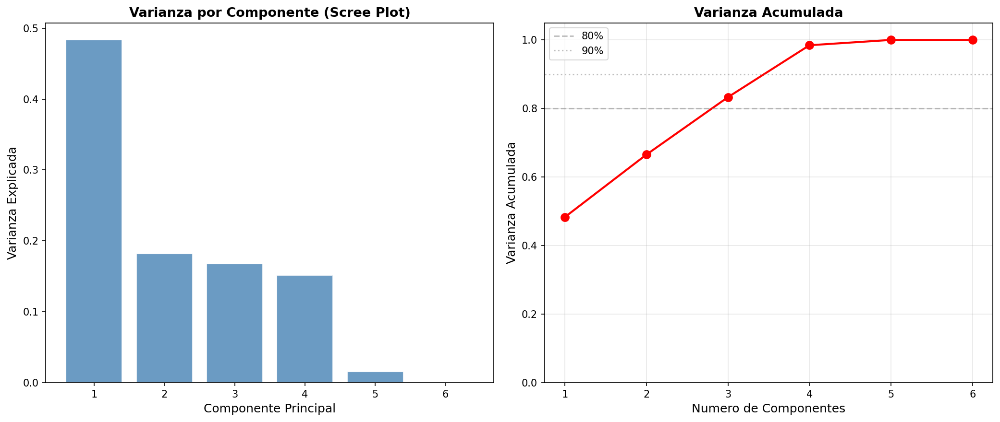

### Etapa 6 - Visualizacion y Comparacion

**PCA - Clusters K-means vs DBSCAN**
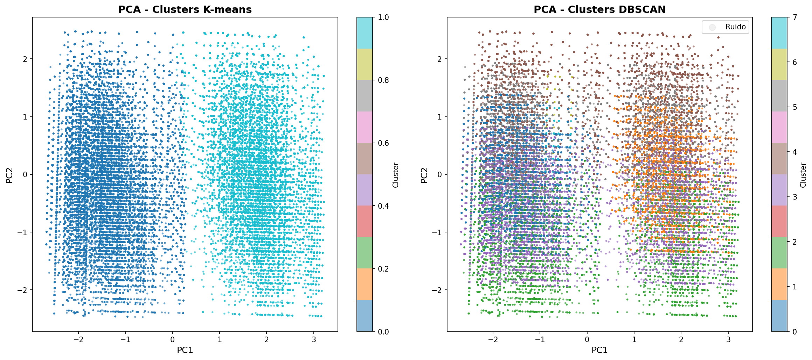

**t-SNE - Clusters K-means vs DBSCAN**
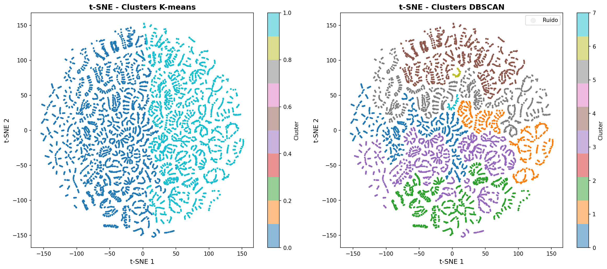

**Panel Comparativo 4 Paneles**
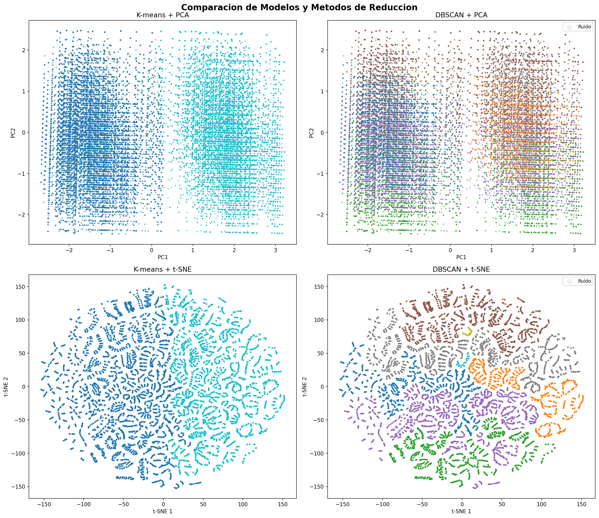

**Heatmap de Perfiles K-means**
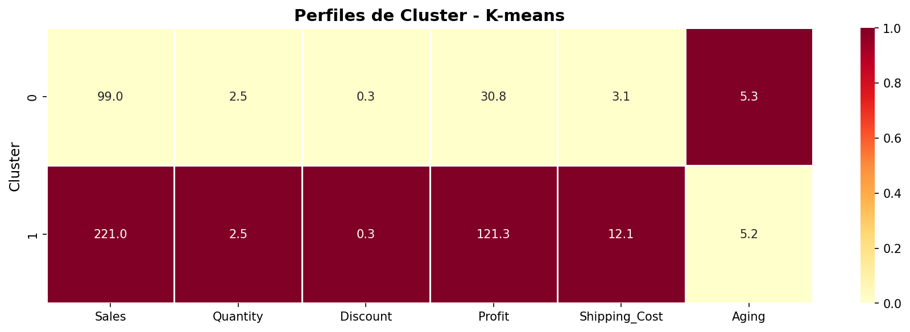

**Heatmap de Perfiles DBSCAN**
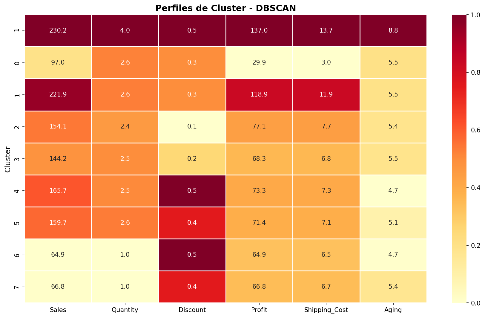

**Distribucion de Tamanio de Clusters**
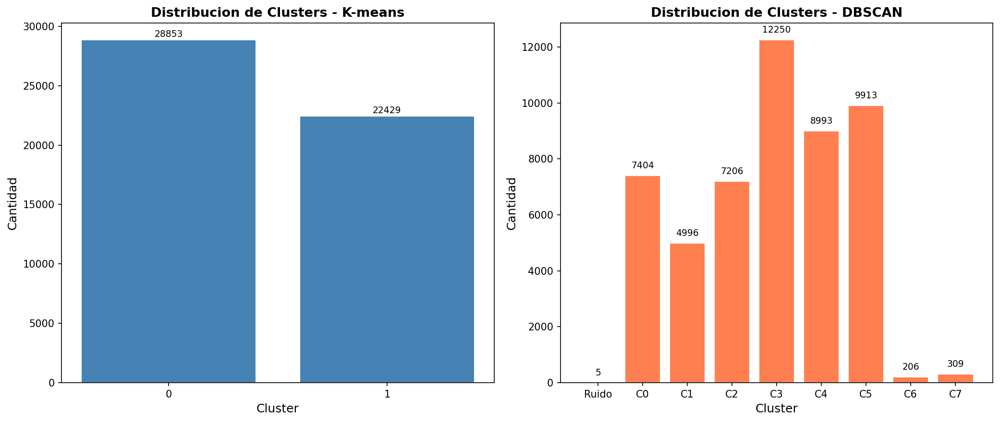

**Boxplots por Cluster K-means**
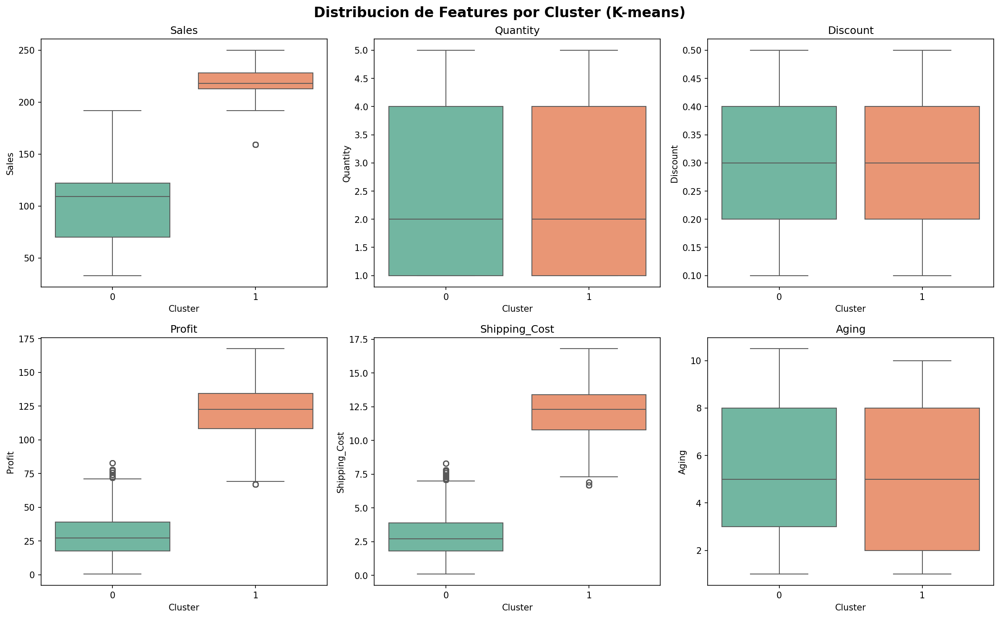

---

## Memoria Tecnica

### 1. Resumen General

Este proyecto implementa un pipeline completo de aprendizaje no supervisado para la segmentacion de transacciones de e-commerce. El flujo abarca desde la carga y exploracion de datos crudos hasta la generacion de perfiles de clientes, pasando por preprocesamiento, clustering, reduccion de dimensionalidad y visualizacion comparativa. Todo el desarrollo se organizo en 6 scripts independientes ejecutados secuencialmente, donde cada etapa consume los artefactos generados por la anterior.

### 2. Datos de Entrada

| Aspecto                | Detalle                                                                   |
| ---------------------- | ------------------------------------------------------------------------- |
| Archivo fuente         | `Data/E-commerce Dataset.csv`                                             |
| Registros originales   | 51,290 transacciones                                                      |
| Columnas originales    | 16                                                                        |
| Valores nulos          | 8 filas (0.016% del total)                                                |
| Tratamiento de nulos   | Eliminacion directa (porcentaje despreciable)                             |
| Registros finales      | 51,282 transacciones                                                      |
| Columnas conservadas   | 10 (6 numericas + 4 categoricas)                                          |
| Columnas eliminadas    | 6 (Order_Date, Time, Customer_Id, Product, Product_Category, Device_Type) |

### 3. Flujo de Datos (Pipeline)

```text
E-commerce Dataset.csv (51,290 x 16)
        |
        v
[Etapa 2: EDA] Limpieza + eliminacion de columnas irrelevantes
        |
        v
E-commerce_limpio.csv (51,282 x 10)
        |
        v
[Etapa 3: Preprocesamiento] LabelEncoder + StandardScaler
        |
        v
features_scaled.csv (51,282 x 6)
        |
        v
[Etapa 4: Modelos] K-means (K=2) + DBSCAN (eps=0.7)
        |
        v
etiquetas_clusters.csv + modelos .pkl
        |
        v
[Etapa 5: Reduccion] PCA (2D) + t-SNE (2D)
        |
        v
coordenadas_pca.csv + coordenadas_tsne.csv
        |
        v
[Etapa 6: Visualizacion] Graficos comparativos + perfiles + reflexion
```

### 4. Decisiones Tecnicas

| Decision                                 | Justificacion                                                                                             |
| ---------------------------------------- | --------------------------------------------------------------------------------------------------------- |
| Eliminar filas con nulos (no imputar)    | Solo 8 de 51,290 filas afectadas (0.016%), imputar seria innecesario                                      |
| Eliminar 6 columnas                      | Temporales (Order_Date, Time), identificadores (Customer_Id), alta cardinalidad (Product, Product_Category) y sin variabilidad informativa (Device_Type) |
| LabelEncoder para categoricas            | One-hot encoding generaria columnas dispersas que distorsionan distancias euclidianas en clustering        |
| StandardScaler (no MinMaxScaler)         | Centra en media 0 y desviacion 1, requerido para K-means y DBSCAN basados en distancia                    |
| 6 features numericas para clustering     | Sales, Quantity, Discount, Profit, Shipping_Cost, Aging: variables con mayor poder discriminante           |
| Muestra de 10,000 puntos para DBSCAN     | Grid search y Silhouette sobre 51K filas resultaba computacionalmente inviable (timeout)                   |
| Clustering antes de reduccion dimensional | PCA 2D captura solo 66.5% de varianza; clustering en 6D preserva toda la informacion                      |
| random_state=42 en todos los modelos     | Garantiza reproducibilidad completa de resultados                                                          |

### 5. Resultados Clave de los Modelos

**K-means (K=2):**

- Cluster 0 (56.3%): Transacciones de bajo valor (Sales=99, Profit=30.8)
- Cluster 1 (43.7%): Transacciones de alto valor (Sales=221, Profit=121.3)
- Silhouette Score: 0.3795
- Calinski-Harabasz: 37,462
- Davies-Bouldin: 1.1241

**DBSCAN (eps=0.7, min_samples=20):**

- 8 clusters + 5 puntos de ruido
- Cluster dominante C3 (23.9%), micro-clusters C6 (0.4%) y C7 (0.6%)
- Silhouette Score: -0.1020
- Calinski-Harabasz: 2,801
- Davies-Bouldin: 3.8298

**PCA:**

- PC1: 48.3% de varianza explicada
- PC2: 18.2% de varianza explicada
- Acumulada 2 componentes: 66.5%
- Acumulada 4 componentes: 98.5%

**t-SNE:**

- Perplexity: 30
- Max iteraciones: 1,000
- KL Divergence: 0.61
- Tiempo de ejecucion: ~10 minutos (51,282 puntos, Barnes-Hut)

### 6. Artefactos Generados

**Datos intermedios (Data/):**

- `E-commerce_limpio.csv` - Dataset limpio tras EDA
- `datos_preprocesados.csv` - Datos con categoricas codificadas
- `features_scaled.csv` - Features escaladas para clustering
- `etiquetas_clusters.csv` - Etiquetas K-means y DBSCAN por transaccion
- `coordenadas_pca.csv` - Proyeccion PCA 2D
- `coordenadas_tsne.csv` - Proyeccion t-SNE 2D

**Modelos (Models/):**

- `standard_scaler.pkl` - StandardScaler ajustado
- `kmeans_model.pkl` - Modelo K-means entrenado (K=2)
- `dbscan_model.pkl` - Modelo DBSCAN entrenado (eps=0.7, min_samples=20)
- `pca_model.pkl` - Modelo PCA ajustado (2 componentes)

**Reportes (results/):**

- 6 reportes de texto (.txt), uno por etapa
- 13 graficos (.png): distribuciones, correlacion, elbow, silhouette, k-distance, varianza PCA, comparaciones de clusters, heatmaps, boxplots, distribucion de tamanios
- 2 tablas de perfiles (.csv): perfiles promedio por cluster para K-means y DBSCAN

### 7. Entorno de Ejecucion

| Componente       | Version/Detalle              |
| ---------------- | ---------------------------- |
| Python           | 3.x                          |
| pandas           | Manejo de DataFrames         |
| numpy            | Operaciones numericas        |
| matplotlib       | Graficos base                |
| seaborn          | Graficos estadisticos        |
| scikit-learn     | Modelos y metricas           |
| joblib           | Persistencia de modelos      |
| Sistema Operativo| Windows 11 Pro               |

### 8. Observaciones Finales

- El pipeline completo se ejecuta en aproximadamente 15-20 minutos, donde t-SNE consume la mayor parte del tiempo (~10 min).
- K-means resulto mas adecuado para este dataset, produciendo segmentos claros y accionables para estrategias de negocio.
- DBSCAN revelo sub-estructuras interesantes pero con menor coherencia interna, influenciado por la maldicion de la dimensionalidad en 6 features.
- Como trabajo futuro se recomienda: agregar datos a nivel de cliente (no transaccion), crear features temporales derivadas, y evaluar HDBSCAN u OPTICS como alternativas a DBSCAN.
